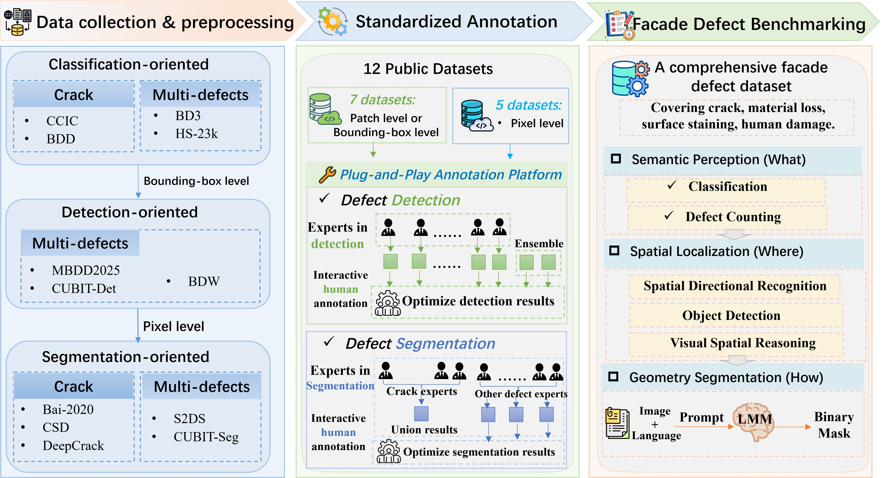

# DefectBench

### A Hierarchical Benchmark for Structural Pathology Reasoning with Large Multimodal Models

[](https://arxiv.org/abs/2603.20148)
[](#dataset)
[](#license)

> **Can Large Multimodal Models Inspect Buildings?**

<!-- TODO: Add framework overview figure here -->
<!-- <p align="center"></p> -->

## Overview

**DefectBench** is the first multi-dimensional benchmark for evaluating Large Multimodal Models (LMMs) on automated building facade inspection. It unifies 12 fragmented open-source datasets into **1,488 images** with **4,527 defect instances**, and evaluates **18 SOTA LMMs** across three escalating cognitive dimensions:

| Level | Dimension | Task | Question |
|:---:|---|---|---|
| L1 | Semantic Perception | Defect Identification & Counting | *"What"* defects exist? |
| L2 | Spatial Localization | Detection & Spatial Reasoning | *"Where"* are they? |
| L3 | Generative Segmentation | Pixel-level Mask Generation | *"How"* do they manifest? |



## Key Findings

- LMMs show **strong semantic understanding** — effectively diagnosing "what" and parsing topological relationships
- **Significant gap in spatial localization** — reasoning-focused models suffer performance collapse in coordinate-based detection
- **Zero-shot generative segmentation is viable** — general-purpose models rival specialized supervised networks without domain-specific training

## Dataset

**1,488 images | 4,527 instances | 4 primary classes | 10 sub-types**

| Primary Class | Sub-types | Instances |
|---|---|---:|
| Crack | Linear crack, Map cracking | 2,122 |
| Material Loss | Spalling, Peeling | 957 |
| Surface Stain | Corrosion, Rust stain, Leakage stain | 1,078 |
| External Fixings | Vegetation, Graffiti, Contaminants | 370 |

> For detailed data format, annotation schema, and source dataset mapping, see **[DATASET.md](DATASET.md)**.

## Quick Start

### Download

```bash
# Clone the repository
git clone https://github.com/<your-username>/DefectBench.git
cd DefectBench
```

### Data Structure

```
DefectBench/
├── final_dataset/
│   ├── images/          # 1,485 facade images (.png)
│   ├── labels/          # Bounding box + taxonomy annotations (.json)
│   └── masks/           # Binary segmentation masks (.png)
├── test_100/            # 100-image evaluation subset
│   ├── images/
│   ├── labels/
│   ├── masks/
│   └── Crack/ Material_loss/ Stain/ External_Fixings/
├── README.md
└── DATASET.md
```

### Load Data (Python)

```python
import json
from PIL import Image

# Load an image and its annotation
image = Image.open("final_dataset/images/003.png")
with open("final_dataset/labels/003.json") as f:
    annotation = json.load(f)

# Access defect instances
for bbox_info in annotation["bboxes"]:
    print(f"[{bbox_info['instance_id']}] "
          f"{bbox_info['taxonomy']['primary_class']} - "
          f"{bbox_info['taxonomy']['sub_type']}")
    print(f"  bbox: {bbox_info['bbox']}")

# Load corresponding mask
mask = Image.open("final_dataset/masks/003_mask.png")
```

## Evaluated Models

<table>
<tr><td>

**Closed-Source**
- Claude-Opus-4.1
- GPT-5.2-Pro / GPT-5.2-Chat / GPT-4o
- Gemini-3-Pro / Gemini-3-Flash
- Doubao-Seed-1.8

</td><td>

**Open-Source**
- Qwen2.5-VL (7B/32B/72B)
- Qwen3-VL (8B/32B-Thinking)
- GLM-4.5V / GLM-4.6V
- InternVL3.5 / DeepSeek-VL2
- LLaVa-34B / Kimi-K2.5

</td></tr>
</table>

## Evaluation Metrics

| Level | Task | Metrics |
|---|---|---|
| L1 | Classification (Q1) | Precision, Recall, F1 |
| L1 | Counting (Q2) | MAE, Relative Error |
| L2 | Detection (Q3) | Precision, Recall, F1 |
| L2 | Spatial Reasoning (Q4) | Precision, Recall, F1 |
| L3 | Segmentation (Q5) | IoU, Dice, mIoU |

## Citation

```bibtex
@article{zhong2025defectbench,
  title={Can Large Multimodal Models Inspect Buildings? A Hierarchical Benchmark for Structural Pathology Reasoning},
  author={Zhong, Hui and Gao, Yichun and Liu, Luyan and Yang, Hai and Wang, Wang and Zhang, Haowei and Zheng, Xinhu},
  journal={arXiv preprint arXiv:2603.20148},
  year={2025}
}
```

## Authors

[Hui Zhong](mailto:hzhong638@connect.hkust-gz.edu.cn)&sup1;, Yichun Gao&sup1;, Luyan Liu&sup2;, Hai Yang&sup2;, Wang Wang&sup3;, Haowei Zhang&sup3;, [Xinhu Zheng](mailto:xinhuzheng@hkust-gz.edu.cn)&sup1;

&sup1; Hong Kong University of Science and Technology (Guangzhou) &nbsp; &sup2; Hong Kong University of Science and Technology &nbsp; &sup3; Hong Kong University

## License

This dataset and benchmark are released for **academic research purposes only**. Please also refer to the individual source datasets for their respective licensing terms.
